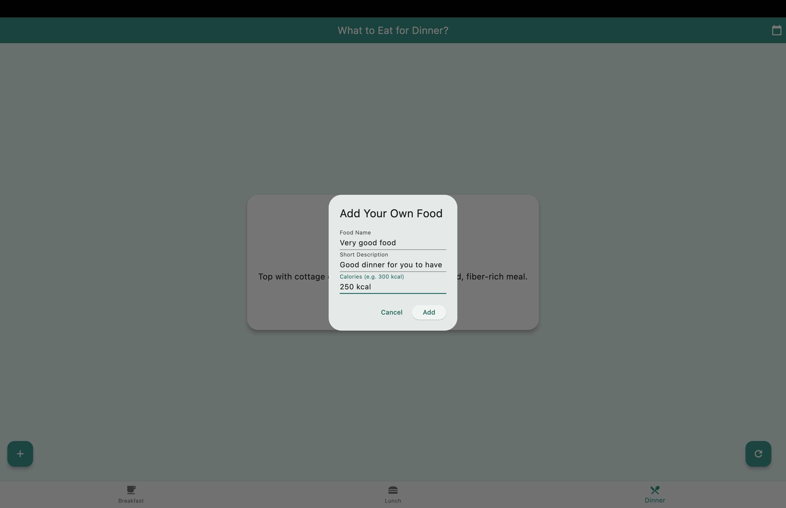
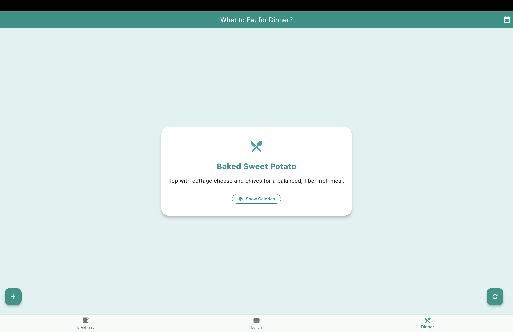
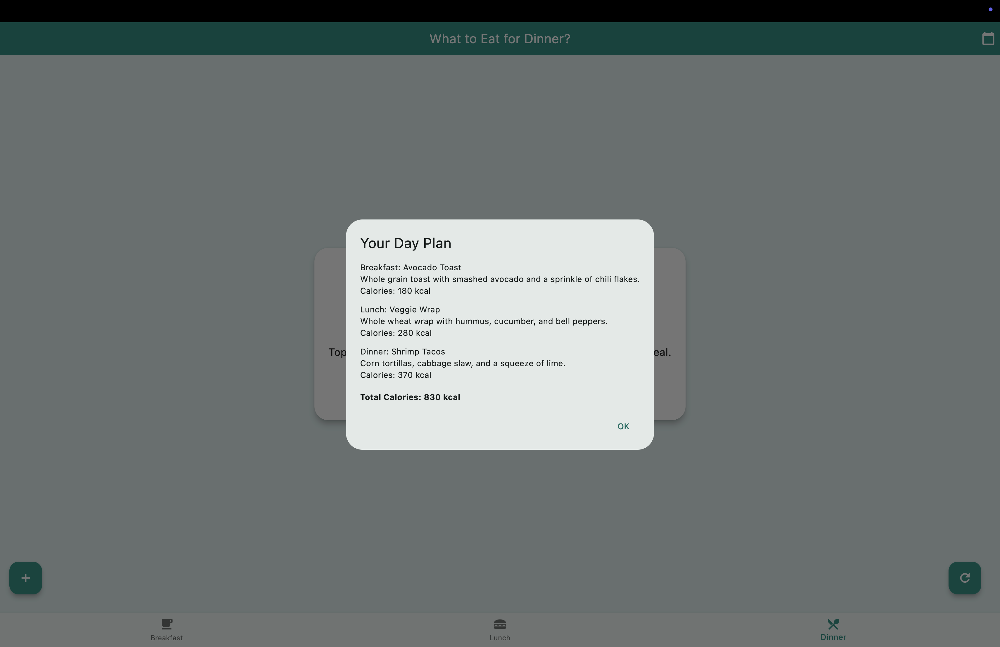

# Food Advisor

This is a simple, attractive Flutter app that helps you decide what to eat for breakfast, lunch, and dinner. It provides healthy meal suggestions, allows you to add your own foods, shows calorie information, and can generate a daily meal plan with total calories.

## Features

- **Three Meal Pages:**
  - Breakfast, Lunch, and Dinner pages, each with their own meal suggestions.
  - Switch between meals using the bottom navigation bar.

- **Meal Suggestions:**
  - Each page displays a random meal suggestion with a short description and estimated calories.
  - Tap the refresh button (bottom right) to get another suggestion.

- **Show Calories:**
  - Tap the "Show Calories" button to see the estimated calories for the current meal.

- **Add Your Own Food:**
  - Tap the add button (bottom left) to add your own meal suggestion, including a name, description, and calories.
  - User-added foods are included in future suggestions and daily plans.

- **Plan for the Day:**
  - Tap the calendar button (top right) to generate a daily meal plan.
  - The app randomly selects one breakfast, one lunch, and one dinner from all available options (including your custom foods).
  - The plan dialog shows the selected meals and the total calories for the day.

- **Present all available options**
  - Tap the present button to see every possible breakfast, lunch, or dinner.
## Screenshots

- 
- 
- 

